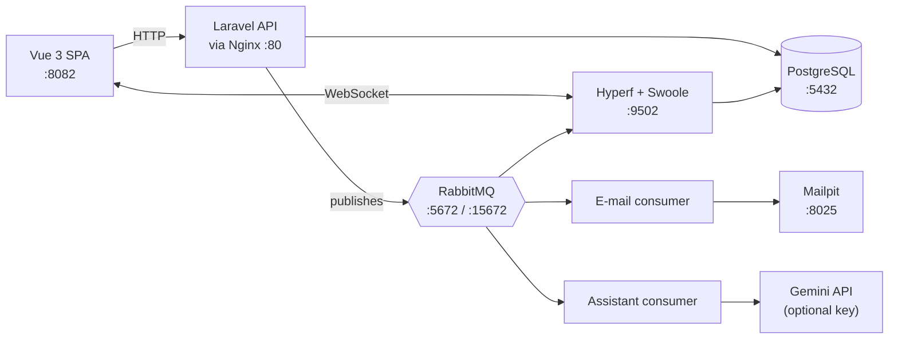
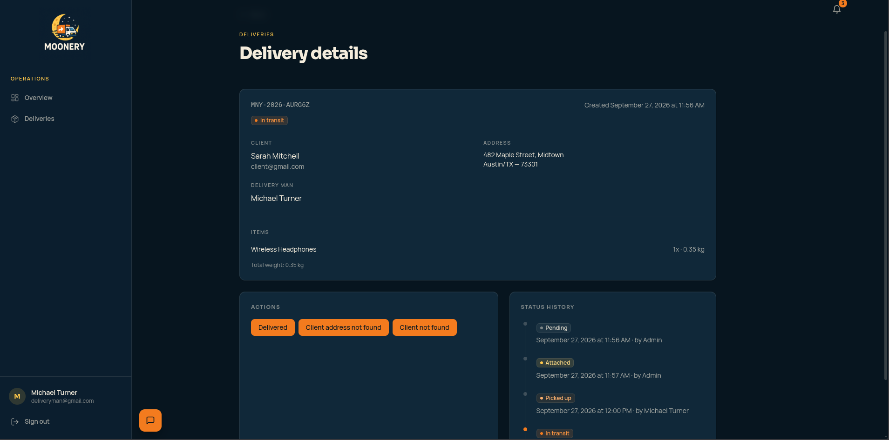
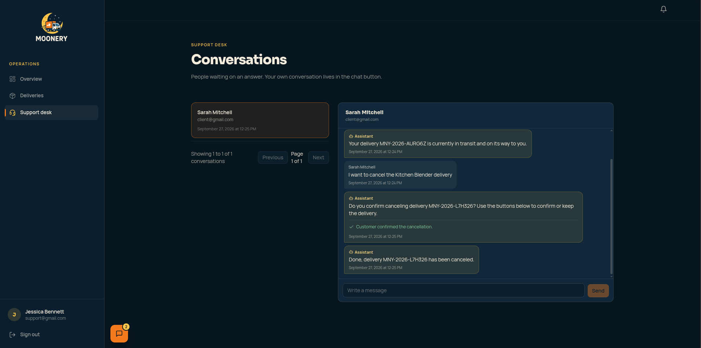

# Moonery · Infrastructure & Getting Started

> **This is the entry point.** It runs the whole platform with one `docker compose up`.
> For the big picture and the engineering decisions, see the
> [organization page](https://github.com/moonery-system).

Moonery is a delivery management platform: an API, a real-time WebSocket service, a Vue single-page app, and an AI assistant in the support chat, all wired together through RabbitMQ.



## What runs

| Service | Technology | Container | Ports |
|---|---|---|---|
| REST API | Laravel 9 / PHP 8.2-fpm | `moonery-laravel` | 9000 |
| Web server | Nginx | `moonery-nginx` | 80, 443 |
| Database | PostgreSQL 15 | `moonery-postgres` | 5432 |
| DB admin | Adminer | `moonery-adminer` | 8081 |
| Message broker | RabbitMQ 3 (management UI) | `moonery-rabbitmq` | 5672, 15672 |
| Dev e-mail inbox | Mailpit | `moonery-mailpit` | 1025 (SMTP), 8025 (UI) |
| E-mail consumer | Laravel command `customs:consume-emails` | `moonery-email-consumer` | n/a |
| Assistant consumer | Laravel command `customs:consume-assistant` | `moonery-assistant-consumer` | n/a |
| WebSocket + AMQP consumers | Hyperf 3.1 / Swoole (PHP 8.3) | `moonery-hyperf` | 9501 (HTTP), 9502 (WS) |
| Frontend | Vue 3 + TypeScript + Tailwind | `moonery-frontend` | 8082 |

Three isolated Docker networks (`db-network`, `rabbitmq-network`, `api-network`) keep each service reaching only what it needs.

## Getting started

**Requirements:** Docker with Compose. Nothing else on your machine.

```bash
# 1. Get the four repositories side by side (this repo is the parent folder)
git clone https://github.com/moonery-system/infra.git moonery && cd moonery
git clone https://github.com/moonery-system/api.git
git clone https://github.com/moonery-system/websocket-api.git
git clone https://github.com/moonery-system/frontend.git

# 2. Environment files
cp .env.example .env                              # Postgres credentials (defaults to root/root)
cp api/.env.example api/.env
cp websocket-api/.env.example websocket-api/.env
printf 'VUE_APP_API_URL=http://localhost/api\nVUE_APP_WS_URL=ws://localhost:9502\n' > frontend/.env
sed -i 's/^DB_PASSWORD=.*/DB_PASSWORD=root/' api/.env websocket-api/.env

# 3. Start the stack and set up the API
docker compose up -d
docker compose exec laravel composer install
docker compose exec laravel php artisan key:generate
docker compose exec laravel php artisan jwt:secret
docker compose exec laravel php artisan customs:refresh-db     # wipe + migrate + seed (~2 s)
docker compose exec hyperf composer install
```

> **One thing that bites:** the WebSocket service verifies the same JWT as the API. Add
> `JWT_SECRET=<the value jwt:secret wrote to api/.env>` to `websocket-api/.env` (it is not in
> the example file). If they differ, every WebSocket connection is refused silently. After
> adding it: `docker compose restart hyperf`.

The frontend container installs its dependencies on first start, so give it a minute, then open **http://localhost:8082**.

### Seeded logins (development only)

| E-mail | Password | Role |
|---|---|---|
| `admin@gmail.com` | `admin` | Admin |
| `client@gmail.com` | `client` | Client |
| `deliveryman@gmail.com` | `deliveryman` | Delivery man |
| `support@gmail.com` | `support` | Support |

These exist only in the development seed. Never reuse them anywhere real.

## Take the tour (5 minutes)

1. **Watch a delivery move.** Sign in as the **delivery man** in one window and as the **client** in another. Take a free delivery and advance its status: the client sees a live notification through the WebSocket.
2. **Try the state machine.** As the client, cancel a delivery that is still *pending*. Then try to cancel one already picked up: the API refuses it.
3. **Talk to support.** As the client, open the chat button; as **support**, open `/support` in the other window and answer.
4. **Ask the AI assistant.** As the client, ask *"Where is my delivery?"* (needs the optional key below; without it the assistant hands the chat to support).
5. **See the plumbing.** Open RabbitMQ at http://localhost:15672 (`guest` / `guest`) to see the exchange and queues, and Mailpit at http://localhost:8025 for the invite e-mails.

## Screenshots

<table>
<tr>
<td width="50%">

**Admin overview**


</td>
<td width="50%">

**Delivery details, as the delivery man** — one button per status the API actually allows next, and the full history below


</td>
</tr>
<tr>
<td width="50%">

**Asking the assistant "where is my delivery?"**


</td>
<td width="50%">

**Asking it to cancel** — the assistant can only propose; only the customer's click confirms


</td>
</tr>
<tr>
<td width="50%">

**The support desk**, after the customer confirmed — the assistant closed the loop on its own


</td>
<td width="50%"></td>
</tr>
</table>

## Optional: turn on the AI assistant

In `api/.env`, set `ASSISTANT_ENABLED=true`, `ASSISTANT_PROVIDER=gemini`, an `ASSISTANT_MODEL` from Google AI Studio, and your `GEMINI_API_KEY`. The full list is in [`api/README.md`](https://github.com/moonery-system/api#readme).

> **Privacy:** Gemini's free tier may use inputs and outputs to improve models. In development use **seed data only**, never real customer data. Keep the key in `api/.env` (it is git-ignored).

## Repository map

| Repository | Purpose |
|---|---|
| **infra** (this one) | `docker-compose.yml`, Nginx config, the engineering handbook |
| [api](https://github.com/moonery-system/api) | REST API, state machine, e-mail and assistant consumers |
| [websocket-api](https://github.com/moonery-system/websocket-api) | Real-time push for notifications and chat |
| [frontend](https://github.com/moonery-system/frontend) | Vue single-page app |

The three application folders are **independent Git repositories** nested inside this one (they are git-ignored here, not submodules). Always check which repository you are in before committing.

## Going deeper

[`CLAUDE.md`](CLAUDE.md) is the engineering handbook: data model, the delivery state machine, the messaging contract, and the pitfalls found along the way. It is written in **Portuguese**.
